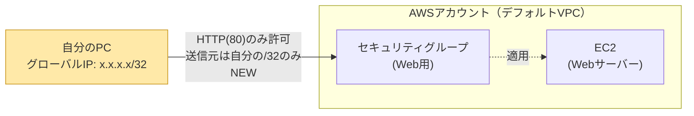

# 006-restrict-source-ip: 送信元IPを自分のIPだけに絞り込む

## 背景・目的

`005-outputs` までで、80番ポートを世界中（`0.0.0.0/0`）に開放したWebサーバーができている。実務でこの設定をそのまま本番に出すことはまずない。本お題では、インバウンドルールの送信元を「自分のグローバルIPアドレスのみ」に絞り込む。**前の問題から新しく追加される概念は「送信元CIDRの絞り込み（`/32`表記）」1つだけである**。EC2・セキュリティグループ・user_data・outputはすべて`005-outputs`の内容をそのまま引き継ぐ。

送信元を絞り込むと、Webサーバーへの動作確認は「自分の環境から」でなければ成功しなくなる。これは望ましい変化であり、次の問題（`007-bastion-sg-reference`）で「自分のIP直指定」から「踏み台サーバー経由」へとさらに発展させる第一歩でもある。

## 登場する概念（詰まったら調べる）

- **CIDR表記と`/32`**: IPアドレスの範囲を表す記法。`0.0.0.0/0`が「全世界」を意味するのに対し、`/32`は「そのIPアドレス1つだけ」を意味する。自分のグローバルIPアドレスを調べる方法（`curl https://checkip.amazonaws.com` など）と、それを`/32`のCIDRとしてセキュリティグループのルールに指定する方法を調べること。
- **自分のグローバルIPアドレスは変わりうる**: 自宅回線やモバイル回線では、再起動やしばらく時間が経つとグローバルIPアドレスが変わることがある（動的IP）。このお題を含め、以降のお題で「自分のIPを指定する」場面では、都度最新のIPを確認し直す必要がある点に注意する。

## 構成図

`005-outputs`までは送信元が`0.0.0.0/0`（誰でもアクセス可）だったインバウンドルールが、自分の`/32`のみに変わる点が今回の変更点である。

## 進め方の手がかり

1. `005-outputs/terraform/` の中身を `006-restrict-source-ip/terraform/` にコピーする
2. 自分の現在のグローバルIPアドレスを調べる
3. セキュリティグループのインバウンドルールの送信元CIDRを、`0.0.0.0/0`から自分のIPの`/32`に書き換える
4. `terraform apply` し、自分の環境から `curl` でアクセスできることを確認する
5. 可能であれば、自分以外のIPアドレス（スマホのテザリングなど別回線、またはオンラインの疎通確認ツール）からもアクセスを試み、失敗する（拒否されるかタイムアウトする）ことを確認する

## 要件（Must）

- [ ] EC2インスタンスが1台起動し `running` 状態であること（`005-outputs` の内容を引き継ぐ）
- [ ] セキュリティグループのインバウンドルールが、TCP80番について自分のグローバルIPアドレス1つのみ（`/32`）を許可し、`0.0.0.0/0`を含む他の送信元を許可していないこと
- [ ] 許可された送信元からのHTTPアクセスで、何らかのレスポンス（2xx/3xx系）が返ること
- [ ] `terraform output` で `instance_id` / `public_ip` / `security_group_id` を引き続き出力すること

## 制約（禁止事項）

- インバウンドルールの送信元に `0.0.0.0/0` または `::/0` を指定しないこと
- インバウンドルールに80番以外のポートを追加しないこと
- 使用可能なAWSサービスはEC2（デフォルトVPCの利用を含む）・セキュリティグループに限定する

## 推奨（Should）

- アウトバウンドルール（egress）が現状どうなっているかも、この機会に見直してみるとよい（本お題のMustには含めないが、今後のお題で絞り込みを扱うことがある）
- `variables.tf` に自分のIPアドレスを変数として切り出しておくと、IPが変わった際に書き換えやすい

## 受入テスト

`tests/acceptance.sh` を参照。概要は以下の通り。本お題からは `terraform output` を使った自動採点になる（環境変数は不要）。スクリプト自身が実行環境の現在のグローバルIPを自動検出して検証に使う。

| # | 検証内容 | コマンド例 | 期待結果 |
|---|---|---|---|
| 1 | インバウンドルールが実行環境のグローバルIPの`/32`のみを許可している | `aws ec2 describe-security-groups` | 許可CIDRが `<検出したIP>/32` のみ、`0.0.0.0/0`など他の送信元が0件 |
| 2 | 許可された送信元からHTTPアクセスが成功する | `curl -o /dev/null -w "%{http_code}"` | HTTPステータスコードが2xx系または3xx系 |

## スコープ外

- 踏み台サーバー経由のアクセス（`007-bastion-sg-reference` で扱う）
- セキュリティグループ同士の参照（`007-bastion-sg-reference` で扱う）
- VPC・サブネットの自作（`008-vpc-subnets` で扱う）

## 難易度

スコア: 11（S=1, R=2, 深さ=1, エッジ=1, T=2）
カテゴリ: なし
