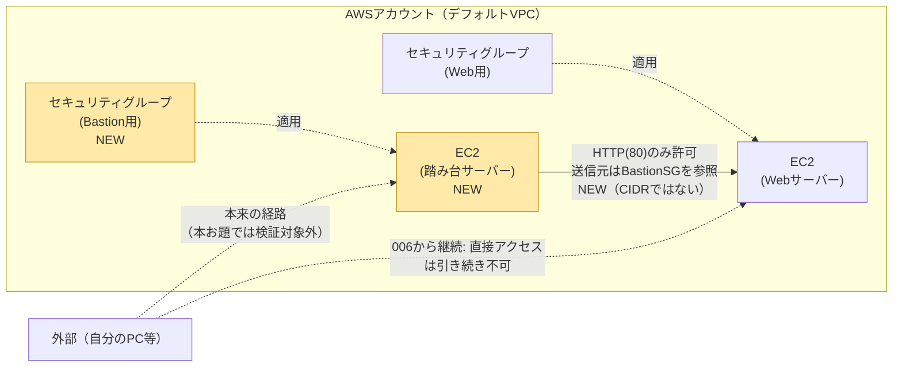

# 007-bastion-sg-reference: 踏み台サーバーのセキュリティグループを参照する

## 背景・目的

`006-restrict-source-ip` では、Webサーバーへのアクセスを自分のグローバルIPの`/32`に絞り込んだ。しかしこの方式には弱点がある。自分のグローバルIPが変わるたびにセキュリティグループを書き換える必要があり、チームで運用する場合は全員のIPを列挙することになり現実的でない。

実務では、代わりに「踏み台サーバー（bastion）」を1台用意し、そのサーバーの**セキュリティグループ**を送信元として許可する設計がよく使われる。CIDR（IPアドレス）ではなく、もう1つのセキュリティグループそのものを送信元に指定できるのがTerraform（AWS）の特徴である。**前の問題から新しく追加される概念は「セキュリティグループが別のセキュリティグループを参照する書き方」1つだけである**。EC2・セキュリティグループの基本、user_data、outputはすべて`006-restrict-source-ip`までの内容を引き継ぐ。

なお本お題では、踏み台サーバー自体へのSSHログインや実際のログイン検証は扱わない。踏み台サーバーは「信頼できる送信元」を表すセキュリティグループの器として使い、「セキュリティグループ同士の参照」という書き方を学ぶことに範囲を絞る。踏み台サーバーに実際にログインして使う一般的な手段（EC2 Instance Connect、Session Manager等）は次の問題以降、または各自の興味に応じて調べてみてほしい。

## 登場する概念（詰まったら調べる）

- **セキュリティグループ同士の参照**: セキュリティグループのインバウンドルールの送信元には、CIDR（IPアドレス範囲）だけでなく、別のセキュリティグループのIDを指定できる。「このセキュリティグループが付いているリソースからの通信のみ許可する」という意味になる。CIDRを直接指定する書き方とは別の引数（属性）を使うので、両者の違いを調べること。
- **踏み台サーバー（bastion / jump server）**: 信頼できるアクセス経路の起点として使う専用のサーバー。今回は「Webサーバーへのアクセスを許可する送信元」としてのみ使い、実際にログインして使う操作は範囲外とする。

## 構成図

`006-restrict-source-ip`までは、Webサーバーへのアクセスを許可するかどうかの判定が「自分のIPの`/32`」というCIDR指定だったのに対し、今回はセキュリティグループそのものを送信元に指定する点が変更点である。「外部から直接アクセスできない」こと自体は006から変わらず継続しており、007で変わるのは判定方法（CIDR→SG参照）のみである。なお、踏み台サーバーへの実際のログイン経路（Outsideから踏み台への矢印）は本お題のMustには含まれず、検証対象外の概念的な経路として図にとどめている。

## 進め方の手がかり

1. `006-restrict-source-ip/terraform/` の中身を `007-bastion-sg-reference/terraform/` にコピーする
2. 踏み台サーバー用のEC2インスタンスと、そのセキュリティグループを追加する（インバウンドルールは無くてよい。本お題では踏み台への接続は検証対象外のため）
3. WebサーバーのセキュリティグループのインバウンドルールのHTTP(80)送信元を、CIDR指定から踏み台サーバーのセキュリティグループを参照する形に書き換える
4. `terraform apply` し、`aws ec2 describe-security-groups` でWeb側のルールが「送信元=踏み台のSG ID」になっているか確認する
5. 外部（踏み台以外）からWebサーバーへの直接アクセスが失敗する（タイムアウトする）ことを確認する

## 要件（Must）

- [ ] EC2インスタンスが2台（Webサーバー・踏み台サーバー）起動し、いずれも `running` 状態であること
- [ ] Webサーバー用セキュリティグループのインバウンドルール（TCP80番）の送信元が、踏み台サーバー用セキュリティグループのみを参照していること（CIDR指定の許可ルールが1件も残っていないこと）
- [ ] 外部（踏み台サーバー以外）からWebサーバーへのHTTP直接アクセスが失敗すること（拒否またはタイムアウト）
- [ ] `terraform output` で、以下5つの値を出力すること
  - `instance_id` / `public_ip` / `security_group_id`: Webサーバー側（`006-restrict-source-ip`から引き継ぐ）
  - `bastion_instance_id`: 踏み台サーバーのインスタンスID
  - `bastion_security_group_id`: 踏み台サーバー用セキュリティグループのID

## 制約（禁止事項）

- Webサーバー用セキュリティグループのインバウンドルールに、CIDR指定（`0.0.0.0/0`や特定IPの`/32`を問わず）を残さないこと。送信元はセキュリティグループ参照のみとする
- Webサーバー用セキュリティグループに80番以外のポートを追加しないこと
- 使用可能なAWSサービスはEC2（デフォルトVPCの利用を含む）・セキュリティグループに限定する

## 推奨（Should）

- 実際に踏み台サーバーとして機能させたい場合は、22番（SSH）を自分のIPの`/32`からのみ許可するとよい（本お題のMustには含めない任意の拡張）
- 踏み台サーバー用のリソースにも `dojo-` 系の命名規則・`Name`タグを付ける

## 受入テスト

`tests/acceptance.sh` を参照。概要は以下の通り。

| # | 検証内容 | コマンド例 | 期待結果 |
|---|---|---|---|
| 1 | 両インスタンスがrunning状態で、WebサーバーSGのインバウンド80番が踏み台SGのみを参照している | `aws ec2 describe-instances` / `aws ec2 describe-security-groups` | 両インスタンスとも`State.Name`=`running`、`UserIdGroupPairs`に踏み台SG IDが含まれ、`IpRanges`（CIDR指定）が0件 |
| 2 | 外部からWebサーバーへのHTTP直接アクセスが失敗する | `curl --max-time N -o /dev/null -w "%{http_code}"` | 接続失敗またはタイムアウト（2xx/3xxが返らない） |

## スコープ外

- 踏み台サーバーへの実際のログイン・SSH接続の検証（任意の学習範囲とし、Mustには含めない）
- VPC・サブネットの自作（`008-vpc-subnets` で扱う）
- NATゲートウェイ（`009-nat-gateway` で扱う）

## 難易度

スコア: 18（S=1, R=4, 深さ=2, エッジ=3, T=2）
カテゴリ: なし
