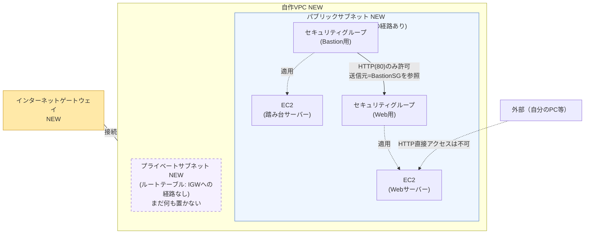

# 008-vpc-subnets: VPCを自作しパブリック/プライベートサブネットに分離する

## 背景・目的

`006`〜`007`まではAWSアカウントに最初から用意されている「デフォルトVPC」をそのまま使ってきた。本お題では初めてVPCを自分で作成し、パブリックサブネットとプライベートサブネットに分離する。**前の問題から新しく追加される概念は「VPC・サブネット・インターネットゲートウェイ・ルートテーブルによるネットワーク自作」1つだけである**。EC2・セキュリティグループ・セキュリティグループ同士の参照・user_data・outputはすべて`007-bastion-sg-reference`までの内容を引き継ぐ。

この時点ではプライベートサブネットには何も配置しない（空のまま用意するだけでよい）。次の問題`009-nat-gateway`でプライベートサブネットに外部通信の経路を用意し、その次の`010-rds-private-connect`で実際にRDSを配置する。「パブリック/プライベートという区分は、実体としては単に『ルートテーブルがインターネットゲートウェイへの経路を持つかどうか』の違いでしかない」という感覚を、この問題で掴んでほしい。

## 登場する概念（詰まったら調べる）

- **VPC (Virtual Private Cloud)**: 自分専用の仮想ネットワーク空間。IPアドレスの範囲（CIDR）を指定して作成する。
- **サブネット**: VPCをさらに分割した領域。1つのサブネットは1つのアベイラビリティゾーン（AZ）に属する。
- **インターネットゲートウェイ (IGW)**: VPCをインターネットと接続するための出入り口。VPCに1つアタッチする。
- **ルートテーブルとルート**: 「どの宛先への通信を、どこ経由で送るか」を定義する経路表。サブネットごとにどのルートテーブルを使うか紐付ける（アソシエーション）。
- **「プライベートサブネット」は特別なリソース種別ではない**: AWSに「プライベートサブネット」という専用のリソースタイプがあるわけではない。単に、インターネットゲートウェイへの経路を持つルートテーブルと紐付いていれば「パブリック」、持たなければ「プライベート」と呼んでいるだけである。VPC作成時に自動的に用意される「メインルートテーブル」には初期状態で外部への経路がないため、新しいサブネットを明示的に別のルートテーブルに紐付けない限り、そのサブネットは自動的に「プライベート」になる。

## 構成図

Web・踏み台とも、デフォルトVPCから自作VPCのパブリックサブネットに引っ越すだけで、セキュリティグループ同士の参照関係（`007`から引き継ぐ）は変わらない。プライベートサブネットは今回まだ空である。

## 進め方の手がかり

1. `007-bastion-sg-reference/terraform/` の中身を `008-vpc-subnets/terraform/` にコピーする
2. VPC・インターネットゲートウェイ・パブリックサブネット・プライベートサブネットを追加する
3. パブリックサブネット用のルートテーブルを作成し、`0.0.0.0/0`宛の経路をインターネットゲートウェイに向け、パブリックサブネットに紐付ける
4. プライベートサブネットには、明示的なルートテーブルの紐付けをまだ行わない（VPCのメインルートテーブルがそのまま使われ、自動的に「プライベート」になる）
5. Webサーバー・踏み台サーバーの両方を、デフォルトVPCからパブリックサブネットに移す（セキュリティグループも新しいVPCに合わせて作り直す）
6. `terraform apply` し、`aws ec2 describe-route-tables` でパブリック側にIGWへの経路があり、プライベート側にはないことを確認する

## 要件（Must）

- [ ] VPCを1つ作成し、パブリックサブネット・プライベートサブネットをそれぞれ1つ以上作成すること
- [ ] パブリックサブネットに紐付くルートテーブルが、インターネットゲートウェイへの`0.0.0.0/0`のデフォルトルートを持つこと
- [ ] プライベートサブネットが、インターネットゲートウェイへの経路を一切持たないこと
- [ ] Webサーバー・踏み台サーバーの両方が `running` 状態であり、自作VPCのパブリックサブネットに配置されていること（デフォルトVPCを使用しないこと）
- [ ] Webサーバー用セキュリティグループのインバウンドルール（TCP80番）の送信元が、踏み台サーバー用セキュリティグループのみを参照していること（`007`の内容を維持する）
- [ ] 外部（踏み台サーバー以外）からWebサーバーへのHTTP直接アクセスが失敗すること（`007`の内容を維持する）
- [ ] `terraform output` で、`007`までの5つの値に加えて以下を出力すること
  - `vpc_id`: 作成したVPCのID
  - `public_subnet_id`: パブリックサブネットのID
  - `private_subnet_id`: プライベートサブネットのID

## 制約（禁止事項）

- デフォルトVPCを使用しないこと（Webサーバー・踏み台サーバーとも自作VPCに配置する）
- プライベートサブネットに、インターネットゲートウェイへの経路を持つルートテーブルを紐付けないこと
- Webサーバー用セキュリティグループのインバウンドルールに、CIDR指定の許可ルールを残さないこと（`007`から継続）
- 使用可能なAWSサービスはEC2・VPC（サブネット・ルートテーブル・インターネットゲートウェイを含む）・セキュリティグループに限定する

## 推奨（Should）

- VPC・サブネットのCIDRブロックは、後続の問題（NATゲートウェイ、RDS用の2つ目のプライベートサブネット）で拡張しやすいよう、余裕を持ったサイズにしておく
- リソース名・タグにVPC/サブネットの役割（`public`/`private`）が分かる命名をする

## 受入テスト

`tests/acceptance.sh` を参照。概要は以下の通り。

| # | 検証内容 | コマンド例 | 期待結果 |
|---|---|---|---|
| 1 | WebサーバーSGのインバウンド80番が踏み台SGのみを参照している（`007`から継続） | `aws ec2 describe-security-groups` | `UserIdGroupPairs`に踏み台SG IDが含まれ、`IpRanges`が0件 |
| 2 | 外部からWebサーバーへのHTTP直接アクセスが失敗する（`007`から継続） | `curl --max-time N` | 接続失敗またはタイムアウト |
| 3 | Web・踏み台がrunning状態で自作VPCのパブリックサブネットに配置され、パブリックサブネットのルートテーブルがIGWへのデフォルトルートを持つ | `aws ec2 describe-instances` / `aws ec2 describe-route-tables` | 両インスタンスとも`State.Name`=`running`かつ`SubnetId`が`public_subnet_id`と一致、ルートテーブルに`0.0.0.0/0 → igw-*`のルートあり |
| 4 | プライベートサブネットがインターネットゲートウェイへの経路を持たない | `aws ec2 describe-route-tables` | プライベートサブネットの実効ルートテーブルに`igw-*`宛のルートが存在しない |

## スコープ外

- プライベートサブネットへの実際のリソース配置（`010-rds-private-connect` で扱う）
- NATゲートウェイの追加（`009-nat-gateway` で扱う）
- 複数AZへの冗長化（このお題では1AZに1サブネットずつでよい。`010-rds-private-connect`でDBサブネットグループ用に2つ目のプライベートサブネットを追加する）
- モジュール化・tfvars分離・リモートステート（今後のお題で扱う）

## 難易度

スコア: 43（S=2, R=10, 深さ=3, エッジ=14, T=4）
カテゴリ: ネットワーク設計系, 配線密度系

深さ×3（9点）とエッジ数×1（14点）の合計23点が、Rの寄与（10点）を上回っており、スコアが伸びている主因はリソース数ではなく配線の密度である（配線密度系）。VPCという「多くのリソースが参照するハブ」を導入したことで、VPC・サブネット・ルートテーブルまわりの配線が一気に増えている（ネットワーク設計系）。プライベートサブネットには**まだ何も配置しない**段階のため、他サービスとの疎通は発生せず、サイレント障害のリスクはまだ顕在化しない。個人のAWSアカウント内で完結して再現できるため、`docs/special-tier.md`が定める採用可否の基準（個人の検証環境で再現できるか）には抵触しない。
