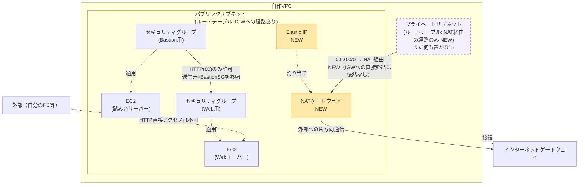

# 009-nat-gateway: プライベートサブネットにNATゲートウェイ経由の外部通信を用意する

## 背景・目的

`008-vpc-subnets` で作ったプライベートサブネットは、インターネットゲートウェイへの経路を持たないため外部と通信できない。しかし実務では、プライベートサブネットに置いたリソース（例えばこの後の問題で置くRDS）自身が外部と通信することはなくても、**同じプライベートサブネットに置く別のリソース**（パッチ適用が必要なサーバーなど）が、パッケージ取得などのために外部への出口を必要とする場面がある。本お題ではその出口として、NATゲートウェイを追加する。**前の問題から新しく追加される概念は「NATゲートウェイ経由の片方向の外部通信経路」1つだけである**。VPC・サブネット・セキュリティグループ同士の参照などは`008-vpc-subnets`までの内容を引き継ぐ。

NATゲートウェイは、プライベートサブネットから外部への通信（アウトバウンド）は許可するが、外部からプライベートサブネットへの通信（インバウンド）は許可しない「片方向」の経路である点が、インターネットゲートウェイ（双方向）との違いである。

**コストに関する重要な注意**: NATゲートウェイは起動している時間に応じて課金され（データ処理量に対する課金も別途発生する）、EC2インスタンス1台よりも時間単価が高い。検証が終わったら、または他の作業で一時的に離席する場合でも、忘れずに `terraform destroy` すること。不要に稼働させ続けるとコストが積み上がる。

## 登場する概念（詰まったら調べる）

- **NATゲートウェイ**: プライベートサブネットのリソースが外部と通信するための、AWSが管理する片方向のゲートウェイ。パブリックサブネットに配置し、プライベートサブネットのルートテーブルから「デフォルトルート（`0.0.0.0/0`）はNATゲートウェイへ」と設定して使う。
- **Elastic IP (EIP)**: 固定のパブリックIPアドレス。NATゲートウェイには1つのEIPを割り当てる必要がある。

## 構成図

プライベートサブネットのルートテーブルに、NATゲートウェイ宛の`0.0.0.0/0`ルートが追加される点が今回の変更点である。インターネットゲートウェイへの直接の経路は引き続き持たない（`008`の制約を維持）。

## 進め方の手がかり

1. `008-vpc-subnets/terraform/` の中身を `009-nat-gateway/terraform/` にコピーする
2. Elastic IPを1つ確保する
3. NATゲートウェイを、パブリックサブネットに配置し、確保したElastic IPを割り当てる
4. プライベートサブネット用のルートテーブルを（これまでは明示的に作っていなかったので）新規に作成し、`0.0.0.0/0`宛の経路をNATゲートウェイに向け、プライベートサブネットに紐付ける
5. `terraform apply` し、`aws ec2 describe-route-tables` でプライベート側の経路がNATゲートウェイ経由になっていることを確認する
6. 確認が終わったら忘れずに `terraform destroy` する（コスト面の注意を参照）

## 要件（Must）

- [ ] Elastic IPを1つ確保し、NATゲートウェイに割り当てること
- [ ] NATゲートウェイをパブリックサブネットに配置すること
- [ ] プライベートサブネットに紐付くルートテーブルが、NATゲートウェイへの`0.0.0.0/0`ルートを持つこと
- [ ] プライベートサブネットが、インターネットゲートウェイへの直接の経路（`igw-*`宛のルート）を持たないこと（`008`から継続）
- [ ] Webサーバー・踏み台サーバーの両方が `running` 状態であり、自作VPCのパブリックサブネットに配置されていること（`008`から継続）
- [ ] Webサーバー用セキュリティグループのインバウンドルール（TCP80番）の送信元が、踏み台サーバー用セキュリティグループのみを参照していること（`008`から継続）
- [ ] 外部（踏み台サーバー以外）からWebサーバーへのHTTP直接アクセスが失敗すること（`008`から継続）
- [ ] `terraform output` で、`008`までの値に加えて以下を出力すること
  - `nat_gateway_id`: NATゲートウェイのID
  - `private_route_table_id`: プライベートサブネット用ルートテーブルのID

## 制約（禁止事項）

- NATゲートウェイをプライベートサブネットに配置しないこと（外部への経路を持つパブリックサブネットに置く必要がある）
- プライベートサブネットにインターネットゲートウェイへの直接ルートを追加しないこと
- Webサーバー用セキュリティグループのインバウンドルールにCIDR指定を残さないこと（`008`から継続）
- 使用可能なAWSサービスはEC2・VPC（サブネット・ルートテーブル・インターネットゲートウェイ・NATゲートウェイ・Elastic IPを含む）・セキュリティグループに限定する

## 推奨（Should）

- 検証が終わったタイミングを忘れないよう、`terraform apply`した日時をメモしておくなど、破棄し忘れを防ぐ工夫をするとよい
- NATゲートウェイ・Elastic IPのタグにも命名規則を揃える

## 受入テスト

`tests/acceptance.sh` を参照。概要は以下の通り。

| # | 検証内容 | コマンド例 | 期待結果 |
|---|---|---|---|
| 1 | WebサーバーSGのインバウンド80番が踏み台SGのみを参照している（`008`から継続） | `aws ec2 describe-security-groups` | `UserIdGroupPairs`に踏み台SG IDが含まれ、`IpRanges`が0件 |
| 2 | 外部からWebサーバーへのHTTP直接アクセスが失敗する（`008`から継続） | `curl --max-time N` | 接続失敗またはタイムアウト |
| 3 | Web・踏み台がrunning状態でパブリックサブネットに配置され、IGWへのデフォルトルートがある（`008`から継続） | `aws ec2 describe-instances` / `aws ec2 describe-route-tables` | 両インスタンスとも`State.Name`=`running`、サブネット一致、IGWルートあり |
| 4 | プライベートサブネットのルートテーブルがNATゲートウェイへの`0.0.0.0/0`ルートを持ち、IGWへの直接ルートは持たない | `aws ec2 describe-route-tables` | NATゲートウェイ宛のデフォルトルートが1件、`igw-*`宛のルートは0件 |

## スコープ外

- プライベートサブネットへの実際のリソース配置（`010-rds-private-connect` で扱う）
- 複数AZでのNATゲートウェイ冗長化（コスト・複雑さの都合上、本お題では1つのみでよい）
- VPCエンドポイント（Gateway/Interface）によるNAT不要化

## 難易度

スコア: 56（S=2, R=14, 深さ=4, エッジ=20, T=4）
カテゴリ: ネットワーク設計系, 配線密度系

`008-vpc-subnets`からさらに、NATゲートウェイ自身がElastic IP・パブリックサブネット・ルートテーブルの3つを新たに参照することで、深さ・エッジ数が伸びている（配線密度系）。プライベートサブネットにはまだ他サービスを配置していないため、サイレント障害のリスクはまだ顕在化しない。個人のAWSアカウント内で完結して再現できるため、`docs/special-tier.md`が定める採用可否の基準には抵触しない。
