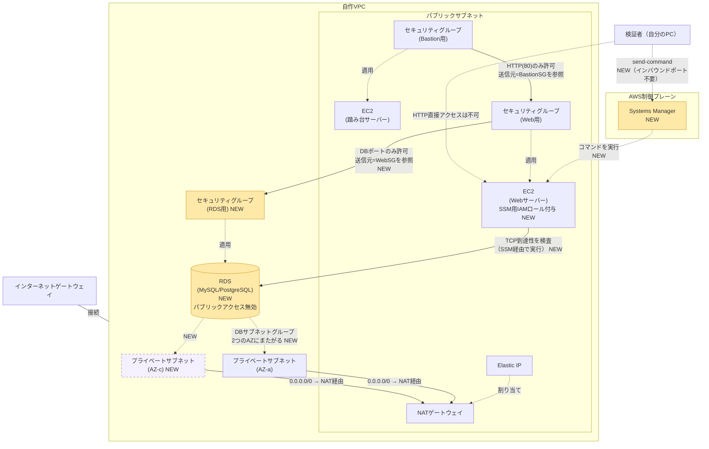

# 010-rds-private-connect: プライベートサブネットのRDSにWebサーバーから接続する

> **特別枠**（[[special-tier]]、`docs/special-tier.md` 参照）。個人のAWSアカウントだけで完結して再現できるため採用除外の対象ではないが、スコアの高さ・配線密度・サイレント障害リスクの大きさから特に注意を要するお題として位置づける。

## 背景・目的

`009-nat-gateway`までで、プライベートサブネットへの片道の出口（NAT経由の外部通信）が用意できた。本お題ではいよいよプライベートサブネットに実体を置く。RDS（MySQLまたはPostgreSQL、どちらでもよい）をプライベートサブネットに配置し、Webサーバー（EC2）のセキュリティグループからの接続のみを許可する。**前の問題から新しく追加される概念は「RDS・DBサブネットグループ・RDS用セキュリティグループがEC2側セキュリティグループを参照する構成」1つだけである**。VPC・サブネット・NATゲートウェイ・セキュリティグループ同士の参照はすべて`009-nat-gateway`までの内容を引き継ぐ。

### なぜ特別枠として扱うのか

`docs/difficulty-score.md`の式で算出すると、このお題はスコア80（後述）と、これまでのkataの中で突出して高い。しかも点数が伸びている主因は「リソースの個数」ではなく、VPC・サブネット・セキュリティグループ同士の参照が積み重なった「配線（依存関係）の密度」である（カテゴリ: 配線密度系）。さらに、EC2とRDSという**複数サービスがプライベートサブネット越しに疎通する**構成であり、DBサブネットグループの片方のAZだけ設定を誤る、セキュリティグループの参照方向を逆にする、といった間違いは`terraform apply`がエラーを出さずに成功したまま、後になって「特定の経路だけ繋がらない」というサイレント障害として現れる。

このお題は個人のAWSアカウント内だけで完結して再現できるため、`docs/special-tier.md`が定める採用可否の基準（個人の検証環境で再現できるかどうか）には抵触せず、除外対象ではない。それでもなお特別枠として明示しているのは、スコアの高さ・配線密度・サイレント障害リスクの大きさから、他のkataと同列に軽い気持ちで着手すると事故りやすいためである。着手前に「作業後の注意」を含め一通り目を通しておくこと。

### 受入テストの検証方法について

道場のこれまでのお題は一貫して「Webサーバーの80番以外は開放しない・SSHは使わない」という方針を取ってきた。加えて`007-bastion-sg-reference`以降、Webサーバーの80番は踏み台サーバーのセキュリティグループからしか許可されていない。この制約の下では、Webサーバーに新しいHTTPエンドポイント（例:`/db-check`）を用意しても、外部（踏み台以外）からはその新しいエンドポイントにも到達できず、結局「本当にRDSに繋がっているか」を外部から確認する手段がない。

そこで本お題では、**AWS Systems Manager (SSM) のRun Command**を使う。SSM Run Commandは、EC2インスタンスに**新しいインバウンドポートを一切開放せずに**、コマンドを実行できる仕組みである（SSMエージェントがインスタンス側からAWSのSSMサービスへアウトバウンド接続する方式のため、80番・22番のようなインバウンドの穴を増やさない）。Webサーバーに、SSMを使うためのIAMロールを付与し、RDSへのTCP到達性を検査するコマンドをWebサーバー上で実行させ、その結果を取得する。これにより、Webサーバーのセキュリティグループ設定（`踏み台からのみ80番許可`）を一切崩さずに、Webサーバーの識別情報（セキュリティグループ）を使った本来の接続経路のテストが行える。

## 登場する概念（詰まったら調べる）

- **RDS (Relational Database Service)**: AWSのマネージドリレーショナルデータベース。MySQL・PostgreSQLなど複数のエンジンから選べる。
- **DBサブネットグループ**: RDSインスタンスをどのサブネットに配置できるかをまとめて指定するリソース。RDSの仕様上、**異なるアベイラビリティゾーン（AZ）に属するサブネットを2つ以上**含める必要がある（シングルAZ構成で使う場合でも、サブネットグループ自体は2AZ以上が必須）。そのため本お題では、プライベートサブネットをもう1つ、別のAZに追加する。
- **RDS用セキュリティグループがEC2用セキュリティグループを参照する**: `007-bastion-sg-reference`で学んだ「セキュリティグループ同士の参照」を、RDS側でも使う。RDSのセキュリティグループのインバウンドルールの送信元に、Webサーバー用セキュリティグループを指定する。
- **SSM Run Commandと、そのためのIAMロール**: EC2インスタンスにSSHで入らずにコマンドを実行できる仕組み。インスタンスに「SSMを使ってよい」というIAMロール（インスタンスプロファイル経由で付与）が必要になる。マネージドポリシー`AmazonSSMManagedInstanceCore`をアタッチするのが標準的な方法。
- **DBのマスターパスワードの扱い**: Terraformの変数にハードコードで直接書くのではなく、`sensitive = true`を指定した変数として渡す方法を調べること（値そのものをコードやコミット履歴に残さない工夫が必要）。

## 構成図

WebサーバーからRDSへの矢印（実線）は、実際のTCP接続の向きを表す（EC2 → RDSの方向にのみ接続を開始できる）。検証者からSSM経由でWebに至る矢印（点線）は、AWSの制御プレーンを介したコマンド実行であり、VPC内のセキュリティグループの許可・拒否とは無関係に成立する（インバウンドポートを一切必要としない）。RDS用セキュリティグループは、CIDRではなくWebサーバー用セキュリティグループを参照する点に注意。

## 進め方の手がかり

1. `009-nat-gateway/terraform/` の中身を `010-rds-private-connect/terraform/` にコピーする
2. 既存のプライベートサブネットとは別のAZに、2つ目のプライベートサブネットを追加する（既存のプライベートサブネット用ルートテーブルに紐付ければよい。NATゲートウェイは1つのままでよい）
3. DBサブネットグループを、2つのプライベートサブネットを含めて作成する
4. RDS用セキュリティグループを作成し、DBのポート（MySQLなら3306、PostgreSQLなら5432）へのインバウンドを、Webサーバー用セキュリティグループからのみ許可する
5. RDSインスタンスを作成する。パブリックアクセスを無効にし、DBサブネットグループ・RDS用セキュリティグループを指定する。マスターパスワードは`sensitive = true`の変数で渡す
6. Webサーバー用のIAMロールを作成し、`AmazonSSMManagedInstanceCore`をアタッチしたインスタンスプロファイルをWebサーバーに付与する（Webサーバーの`user_data`・セキュリティグループは変更不要）
7. `terraform apply` 後、`aws ssm send-command` でWebサーバー上に「RDSエンドポイントへのTCP到達性を確認するコマンド（例: `timeout 3 bash -c "echo > /dev/tcp/<RDSエンドポイント>/<ポート>" && echo OK || echo FAIL`）」を実行させ、`aws ssm get-command-invocation` で結果を取得する
8. **確認が終わったら必ず `terraform destroy` する**（後述の注意を参照）

## 要件（Must）

- [ ] 既存のプライベートサブネットとは異なるAZに、2つ目のプライベートサブネットを作成すること
- [ ] DBサブネットグループを作成し、異なる2つのAZのプライベートサブネットを含めること
- [ ] RDSインスタンス（MySQLまたはPostgreSQL）を1つ作成し、パブリックアクセスを無効にすること
- [ ] RDS用セキュリティグループのインバウンドルール（DBポート）が、Webサーバー用セキュリティグループのみを参照していること（CIDR指定の許可ルールが1件も残っていないこと）
- [ ] Webサーバーに、SSM Run Commandを実行できるIAMロール（インスタンスプロファイル経由）が付与されていること
- [ ] Webサーバー用セキュリティグループのインバウンドルール（TCP80番）の送信元が、踏み台サーバー用セキュリティグループのみを参照していること（`009`から継続、SSM用のIAMロール追加によってセキュリティグループ自体は変更しない）
- [ ] 外部（踏み台サーバー以外）からWebサーバーへのHTTP直接アクセスが失敗すること（`009`から継続）
- [ ] SSM Run CommandでWebサーバー上からRDSエンドポイントへのTCP到達性を確認するコマンドを実行し、成功結果（`OK`など到達成功を示す出力）が得られること
- [ ] `terraform output` で、`009`までの値に加えて以下を出力すること
  - `private_subnet2_id`: 2つ目のプライベートサブネットのID
  - `rds_security_group_id`: RDS用セキュリティグループのID
  - `db_instance_identifier`: RDSインスタンスの識別子
  - `rds_endpoint`: RDSのエンドポイント（ホスト名）
  - `rds_port`: RDSの接続ポート番号

> マスターパスワードのハードコード禁止は、Mustではなく次の「制約」に置く。AWSはRDSの実際のパスワード値をAPI経由で一切返さないため、`tests/acceptance.sh`（AWS API呼び出し）でハードコードの有無を機械的に検証することは原理的にできない。レビュー時は`terraform plan`の差分出力で、パスワードの値が伏字（`(sensitive value)`）になっているかを目視確認する。

## 制約（禁止事項）

- RDSのパブリックアクセスを有効にしないこと
- RDS用セキュリティグループのインバウンドルールに`0.0.0.0/0`・`::/0`・特定IPのCIDR指定を含めないこと。送信元はWebサーバー用セキュリティグループの参照のみとする
- RDSをパブリックサブネットに配置しないこと（DBサブネットグループは2つのプライベートサブネットのみを含める）
- マスターパスワードを`variables.tf`のデフォルト値やコード中に平文で書かないこと
- Webサーバー用セキュリティグループのインバウンドルールにCIDR指定を残さないこと、また新しいインバウンドポート（SSH等）を追加しないこと（`009`から継続。SSMはインバウンドポートを必要としない）
- WebサーバーのIAMロールに、`AmazonSSMManagedInstanceCore`以外の広範な権限（`*`を使った管理者権限など）を付与しないこと
- 使用可能なAWSサービスはEC2・VPC（サブネット・ルートテーブル・インターネットゲートウェイ・NATゲートウェイ・Elastic IPを含む）・セキュリティグループ・RDS・IAM（SSM用のロールに限る）に限定する

## 推奨（Should）

- RDSインスタンスクラスは無料利用枠対象（`db.t3.micro`や`db.t4g.micro`など）を選ぶ
- `skip_final_snapshot`の扱いを調べ、`terraform destroy`時に不要なスナップショットが残らないようにしておくとよい（検証用途のため）
- マスターパスワードの管理について、AWS Secrets Managerの利用も調べてみるとよい（本お題のMustには含めない発展的な内容）

## 受入テスト

`tests/acceptance.sh` を参照。概要は以下の通り。

| # | 検証内容 | コマンド例 | 期待結果 |
|---|---|---|---|
| 1 | Web SG（踏み台SGのみ参照）・RDS SG（Web SGのみ参照）がいずれもCIDR許可を持たない | `aws ec2 describe-security-groups` | 両SGとも`UserIdGroupPairs`に想定のSG IDが含まれ、`IpRanges`が0件 |
| 2 | 外部からWebサーバーへのHTTP直接アクセスが失敗する | `curl --max-time N` | 接続失敗またはタイムアウト |
| 3 | RDSがパブリックアクセス不可で、異なる2つのAZのプライベートサブネットにまたがるDBサブネットグループに配置されている | `aws rds describe-db-instances` | `PubliclyAccessible`=`false`、サブネットグループのAZが2種類以上 |
| 4 | SSM Run CommandでWebサーバーからRDSへのTCP到達性確認が成功する | `aws ssm send-command` → `aws ssm get-command-invocation` | コマンドの実行結果（標準出力）に到達成功を示す文字列が含まれる |

## 設問（着手前に自分の言葉で考えること）

1. VPC・サブネット・ルートテーブル・NATゲートウェイ・セキュリティグループ・RDSインスタンス自体（基盤）は、なぜTerraformで管理するのが適しているか。
2. SSM経由で実行する到達性確認コマンドの中身や、将来アプリケーションが使うテーブルのスキーマ定義のような「プロジェクトレベルの資材」は、同じ調子でTerraformのリソース定義に書き続けるべきか。書き続けることの限界はどこにあるか（コード量が増えた場合、変更頻度が上がった場合を想像してみる）。
3. 上記の判断は、Databricks（Databricks Asset Bundles）やBedrock AgentCore（専用SDK/CLI）のように「プラットフォームレベルはTerraform、プロジェクトレベルは専用ツール」という役割分担の考え方とどう共通するか。

## 作業後の注意（必読）

- 確認が終わったら、または作業を中断する場合は**必ず`terraform destroy`を実行すること**。
- 本お題で使うNATゲートウェイ・RDSインスタンスはいずれも時間課金であり、EC2インスタンス単体の構成に比べて放置時のコストが大きい。特にRDSはマルチAZ構成にしなくても、インスタンスクラス次第では想像以上の時間単価になることがあるため、稼働させたままにしないこと。
- `terraform destroy`後も、RDSのスナップショットが`skip_final_snapshot`の設定次第では残ることがある。AWSコンソールでも最終確認するとよい。

## スコープ外

- Webサーバーからの実際のSQLクエリ発行・アプリケーションロジック（TCP到達性の確認のみで十分とする）
- RDSのマルチAZ配置・リードレプリカ
- AWS Secrets Managerによるパスワード管理（推奨に留め、Mustには含めない）
- Databricks・Bedrock AgentCoreなど、実際の専用ツールを使った基盤/プロジェクトの役割分担の実装（本お題は「考え方」を問うに留める）

## 難易度

スコア: 80（S=4, R=22, 深さ=4, エッジ=32, T=4）
カテゴリ: ネットワーク設計系, 配線密度系

深さ×3（12点）とエッジ数×1（32点）の合計44点が、Rの寄与（22点）を上回っており、点数が伸びている主因が「リソース数」ではなく「配線密度」であることを裏付けている（配線密度系）。VPC・プライベートサブネット・RDSという複数サービスがネットワーク越しに疎通する構成でもある（ネットワーク設計系）。SSM用のIAMロール追加によりS（サービス種類数）もEC2・VPC・RDS・IAMの4種類に増えている。個人のAWSアカウント内だけで再現できるため、[[special-tier]]が定める採用可否の基準には抵触しない。
